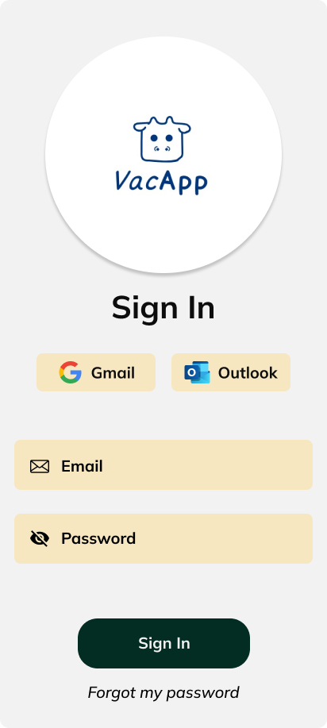

  

  <strong>UNIVERSIDAD PERUANA DE CIENCIAS APLICADAS</strong> 
  <strong>FACULTAD DE INGENIERÍA</strong> 
  <strong>PROGRAMA ACADÉMICO DE INGENIERÍA DE SOFTWARE</strong> 
  <strong>11ASI0732-2520-7491 - DISEÑO DE EXPERIMENTOS DE INGENIERÍA DE SOFTWARE</strong>

  <em><strong>VacApp</strong></em> 
  <em><strong>TB1</strong></em>

  <strong>DOCENTE:</strong> 
  Ivan Robles Fernandez

  <strong>STARTUP:</strong> 
  Vacow Team

<h3 align="center">Team Members:</h3>

| **Member**               | **Code**   |
| ------------------------ | ---------- |
| Saldana,Rodrigo Liberato | U202215623 |
| Macavilca Quispe, Ian    | U202121325 |
| Rojas Velasquez, Maycol  | U202219984 |
|                          |            |
|                          |            |

<strong>Septiembre 2025</strong>

# Registro de Versiones del Informe

| Versión | Fecha      | Autor                          | Descripción de modificación               |
| ------- | ---------- | ------------------------------ | ----------------------------------------- |
| TB1     | 14/09/2025 | Maycol Jhordan Rojas Velásquez | Creación inicial del documento            |
| TB1     | 14/09/2025 | Maycol Jhordan Rojas Velásquez | Estructuración del documento              |
| TB1     | 14/09/2025 | Maycol Jhordan Rojas Velásquez | Perfil de los integrantes                 |
| TB1     | 14/09/2025 | Maycol Jhordan Rojas Velásquez | Definición de segmentos objetivos         |
| TB1     | 14/09/2025 | Maycol Jhordan Rojas Velásquez | Style Guideline                           |
| TB1     | 14/09/2025 | Maycol Jhordan Rojas Velásquez | General Style Guidelines                  |
| TB1     | 14/09/2025 | Maycol Jhordan Rojas Velásquez | Web Style Guidelines                      |
| TB1     | 14/09/2025 | Maycol Jhordan Rojas Velásquez | Mobile Style Guidelines                   |
| TB1     | 14/09/2025 | Maycol Jhordan Rojas Velásquez | iOS Mobile Style Guidelines               |
| TB1     | 14/09/2025 | Maycol Jhordan Rojas Velásquez | Android Mobile Style Guidelines           |
| TB1     | 14/09/2025 | Maycol Jhordan Rojas Velásquez | Landing Page UI Design                    |
| TB1     | 14/09/2025 | Maycol Jhordan Rojas Velásquez | Landing Page Wireframe                    |
| TB1     | 14/09/2025 | Maycol Jhordan Rojas Velásquez | Landing Page Mock-up                      |
| TB1     | 14/09/2025 | Maycol Jhordan Rojas Velásquez | Mobile Applications UX/UI Design          |
| TB1     | 14/09/2025 | Maycol Jhordan Rojas Velásquez | Mobile Applications Wireframes            |
| TB1     | 14/09/2025 | Maycol Jhordan Rojas Velásquez | Mobile Applications Wireflow Diagrams     |
| TB1     | 14/09/2025 | Maycol Jhordan Rojas Velásquez | Mobile Applications Mock-ups              |
| TB1     | 14/09/2025 | Maycol Jhordan Rojas Velásquez | Mobile Applications User Flow Diagrams    |
| TB1     | 14/09/2025 | Maycol Jhordan Rojas Velásquez | Mobile Applications Prototyping           |
| TB1     | 14/09/2025 | Maycol Jhordan Rojas Velásquez | Android Mobile Applications Prototyping   |
| TB1     | 14/09/2025 | Maycol Jhordan Rojas Velásquez | iOS Mobile Applications Prototyping       |
| TB1     | 14/09/2025 | Maycol Jhordan Rojas Velásquez | Domain-Driven Software Architecture.      |
| TB1     | 14/09/2025 | Maycol Jhordan Rojas Velásquez | Software Architecture Context Diagram     |
| TB1     | 14/09/2025 | Maycol Jhordan Rojas Velásquez | Software Architecture Container Diagrams  |
| TB1     | 14/09/2025 | Maycol Jhordan Rojas Velásquez | Software Architecture Components Diagrams |

# Project Report Collaboration Insights

#### 1. URL del Repositorio en GitHub

| Repositorio del Informe en GitHub                     |
| ----------------------------------------------------- |
| https://github.com/orgs/1ASI0732-Grupo-3/repositories |

#### 2. Actividades de Elaboración del Informe

| Actividad                       | Descripción                                                                                                                                                                                                                                            |
| ------------------------------- | ------------------------------------------------------------------------------------------------------------------------------------------------------------------------------------------------------------------------------------------------------ |
| Comunicación de avances         | Se realizaron breves reuniones donde se comentaban los avances de cada integrante para garantizar un trabajo en equipo sincronizado y estar al tanto de cada modificación.                                                                             |
| Delegación de responsabilidades | Se organizaron charlas y reuniones para la delegación de tareas, promoviendo el trabajo en equipo y el avance continuo de manera asíncrona.                                                                                                            |
| Recopilación de datos           | Se realizó un estudio del mercado, utilizando los segmentos objetivos para extraer datos significativos mediante entrevistas. Además, se utilizaron referencias bibliográficas para investigar información relevante dentro del desarrollo del informe |
| Documentación                   | Se desarrollaron diferentes capítulos del informe, utilizando las técnicas, herramientas y metodologías requeridas.                                                                                                                                    |

#### 3. Capturas de Imagen de los Analíticos de Colaboración y Commits en GitHub

| Métrica                     | Descripción |
| --------------------------- | ----------- |
| Número de commits por autor |             |
| Historial de cambios        |             |

#### 4. Participación de Todos los Miembros del Equipo

| Evidencia                 | Descripción                                                                                                                                                     |
| ------------------------- | --------------------------------------------------------------------------------------------------------------------------------------------------------------- |
| Contribuciones en GitHub  | Cada integrante del equipo completó sus tareas y subió sus avances al repositorio de GitHub. Adempas, cada uno colaboró revisando el trabajo de sus compañeros. |
| Discusiones y actividades | Se organizaron encuentros virtuales para compartir avances, resolver dudas y atender los desafíos de cada actividad.                                            |
| Exposiciones del proyecto | Se llevaron a cabo sesiones para exponer el trabajo realizado antes de la fecha orrespondiente y prepararnos adecuadamente para la presentación final.          |

# Tabla de Contenidos

## Capítulo I: Introducción

- [1.1. Start-up Profile](#11-start-up-profile)
  - [1.1.1. Descripción de la Startup](#111-descripción-de-la-startup)
  - [1.1.2. Perfiles de Integrantes del Equipo](#112-perfiles-de-integrantes-del-equipo)
- [1.2. Solution Profile](#12-solution-profile)
  - [1.2.1. Antecedentes y Problemática](#121-antecedentes-y-problemática)
  - [1.2.2. Lean UX Process](#122-lean-ux-process)
    - [1.2.2.1. Lean UX Problem Statements](#1221-lean-ux-problem-statements)
    - [1.2.2.2. Lean UX Assumptions](#1222-lean-ux-assumptions)
    - [1.2.2.3. Lean UX Hypothesis Statements](#1223-lean-ux-hypothesis-statements)
    - [1.2.2.4. Lean UX Canvas](#1224-lean-ux-canvas)
- [1.3. Segmentos Objetivo](#13-segmentos-objetivo)

---

## Capítulo II: Requirements Elicitation & Analysis

- [2.1. Competidores](#21-competidores)
  - [2.1.1. Análisis Competitivo](#211-análisis-competitivo)
  - [2.1.2. Estrategias y Tácticas frente a Competidores](#212-estrategias-y-tácticas-frente-a-competidores)
- [2.2. Entrevistas](#22-entrevistas)
  - [2.2.1. Diseño de Entrevistas](#221-diseño-de-entrevistas)
  - [2.2.2. Registro de Entrevistas](#222-registro-de-entrevistas)
  - [2.2.3. Análisis de Entrevistas](#223-análisis-de-entrevistas)
- [2.3. Needfinding](#23-needfinding)
  - [2.3.1. User Personas](#231-user-personas)
  - [2.3.2. User Task Matrix](#232-user-task-matrix)
  - [2.3.3. User Journey Mapping](#233-user-journey-mapping)
  - [2.3.4. Empathy Mapping](#234-empathy-mapping)
  - [2.3.5. As-is Scenario Mapping](#235-as-is-scenario-mapping)
- [2.4. Ubiquitous Language](#24-ubiquitous-language)

---

## Capítulo III: Requirements Specification

- [3.1. To-Be Scenario Mapping](#31-to-be-scenario-mapping)
- [3.2. User Stories](#32-user-stories)
- [3.3. Impact Mapping](#33-impact-mapping)
- [3.4. Product Backlog](#34-product-backlog)

---

## Capítulo IV: Product Design

- [4.1. Style Guidelines](#41-style-guidelines)
  - [4.1.1. General Style Guidelines](#411-general-style-guidelines)
  - [4.1.2. Web Style Guidelines](#412-web-style-guidelines)
  - [4.1.3. Mobile Style Guidelines](#413-mobile-style-guidelines)
    - [4.1.3.1. iOS Mobile Style Guidelines](#4131-ios-mobile-style-guidelines)
    - [4.1.3.2. Android Mobile Style Guidelines](#4132-android-mobile-style-guidelines)
- [4.2. Information Architecture](#42-information-architecture)
  - [4.2.1. Organization Systems](#421-organization-systems)
  - [4.2.2. Labeling Systems](#422-labeling-systems)
  - [4.2.3. SEO Tags and Meta Tags](#423-seo-tags-and-meta-tags)
  - [4.2.4. Searching Systems](#424-searching-systems)
  - [4.2.5. Navigation Systems](#425-navigation-systems)
- [4.3. Landing Page UI Design](#43-landing-page-ui-design)
  - [4.3.1. Landing Page Wireframe](#431-landing-page-wireframe)
  - [4.3.2. Landing Page Mock-up](#432-landing-page-mock-up)
- [4.4. Mobile Applications UX/UI Design](#44-mobile-applications-uxui-design)
  - [4.4.1. Wireframes](#441-mobile-applications-wireframes)
  - [4.4.2. Wireflow Diagrams](#442-mobile-applications-wireflow-diagrams)
  - [4.4.3. Mock-ups](#443-mobile-applications-mock-ups)
  - [4.4.4. User Flow Diagrams](#444-mobile-applications-user-flow-diagrams)
- [4.5. Mobile Applications Prototyping](#45-mobile-applications-prototyping)
  - [4.5.1. Android Prototyping](#451-android-mobile-applications-prototyping)
  - [4.5.2. iOS Prototyping](#452-ios-mobile-applications-prototyping)
- [4.6. Web Applications UX/UI Design](#46-web-applications-uxui-design)
  - [4.6.1. Wireframes](#461-web-applications-wireframes)
  - [4.6.2. Wireflow Diagrams](#462-web-applications-wireflow-diagrams)
  - [4.6.3. Mock-ups](#463-web-applications-mock-ups)
  - [4.6.4. User Flow Diagrams](#464-web-applications-user-flow-diagrams)
- [4.7. Web Applications Prototyping](#47-web-applications-prototyping)
- [4.8. Domain-Driven Software Architecture](#48-domain-driven-software-architecture)
  - [4.8.1. Context Diagram](#481-software-architecture-context-diagram)
  - [4.8.2. Container Diagrams](#482-software-architecture-container-diagrams)
  - [4.8.3. Component Diagrams](#483-software-architecture-components-diagrams)
- [4.9. Software Object-Oriented Design](#49-software-object-oriented-design)
  - [4.9.1. Class Diagrams](#491-class-diagrams)
  - [4.9.2. Class Dictionary](#492-class-dictionary)
- [4.10. Database Design](#410-database-design)
  - [4.10.1. Relational/Non-Relational Database Diagram](#4101-relationalnon-relational-database-diagram)

---

## Capítulo V: Product Implementation

- [5.1. Software Configuration Management](#51-software-configuration-management)
  - [5.1.1. Development Environment Configuration](#511-software-development-environment-configuration)
  - [5.1.2. Source Code Management](#512-source-code-management)
  - [5.1.3. Code Style Guide & Conventions](#513-source-code-style-guide--conventions)
  - [5.1.4. Deployment Configuration](#514-software-deployment-configuration)
- [5.2. Product Implementation & Deployment](#52-product-implementation--deployment)
  - [5.2.1. Sprint Backlogs](#521-sprint-backlogs)
  - [5.2.2. Landing Page Evidence](#522-implemented-landing-page-evidence)
  - [5.2.3. Frontend Web Application Evidence](#523-implemented-frontend-web-application-evidence)
  - [5.2.4. Native Mobile Application Evidence](#524-implemented-native-mobile-application-evidence)
  - [5.2.5. RESTful API / Serverless Backend Evidence](#525-implemented-restful-api-andor-serverless-backend-evidence)
  - [5.2.6. API Documentation](#526-restful-api-documentation)
  - [5.2.7. Team Collaboration Insights](#527-team-collaboration-insights)
- [5.3. Video About the Product](#53-video-about-the-product)

- [Conclusiones](#61-conclusiones)
- [Bibliografía](#62-bibliografía)
- [Anexos](#63-anexos)

# STUDENT OUTCOME

El curso contribuye al cumplimiento del Student Outcome ABET:

##### ABET – EAC - Student Outcome 4

Criterio: La capacidad de reconocer responsabilidades éticas y profesionales en
situaciones de ingeniería y hacer juicios informados, que deben considerar el
impacto de las soluciones de ingeniería en contextos globales, económicos,
ambientales y sociales.

| **Criterio específico**                                                                                                                                      | **Acciones realizadas**                                           | **Conclusiones** |
| ------------------------------------------------------------------------------------------------------------------------------------------------------------ | ----------------------------------------------------------------- | ---------------- |
| 4.c.1 Reconoce responsabilidad ética y profesional en situaciones de ingeniería de software                                                                  |    1. Rojas Velasquez, Maycol Jhordan _TB1:_  Apliqué |                  |
| 4.c.2 Emite juicios informados considerando el impacto de las soluciones de ingeniería de software en contextos globales, económicos, ambientales y sociales |    1. Rojas Velasquez, Maycol Jhordan _TB1:_  Apliqué |                  |

## Capítulo I: Introducción

### 1.1. Start-up Profile

#### 1.1.1. Descripción de la Startup

#### 1.1.2. Perfiles de integrantes del equipo

| Integrante                                                                                                                                                                                                                                                       | Conocimientos técnicos / Habilidades                                                                                                                                                                                                                                                                                                                                                                                                                                                                                                                                                                                                                                                                                                                                                                                                                                          |
| ---------------------------------------------------------------------------------------------------------------------------------------------------------------------------------------------------------------------------------------------------------------- | ----------------------------------------------------------------------------------------------------------------------------------------------------------------------------------------------------------------------------------------------------------------------------------------------------------------------------------------------------------------------------------------------------------------------------------------------------------------------------------------------------------------------------------------------------------------------------------------------------------------------------------------------------------------------------------------------------------------------------------------------------------------------------------------------------------------------------------------------------------------------------- |
| Ian Macavilca Quispe   (U202121325)                                                                          | Programación en C++, Python, JavaScript, HTML y CSS. Aprendo rápido y sé adaptarme a los retos que se presentan a lo largo del desarrollo de proyectos.                                                                                                                                                                                                                                                                                                                                                                                                                                                                                                                                                                                                                                                                                                                       |
| Rodrigo Liberato Saldaña    | Estudiante de Ingeniería de Software con interés en Ciencia de Datos, Ciberseguridad y desarrollo web en .NET, spring boot, etc. Me comprometo a apoyar activamente al grupo y asumir el rol de líder para encaminar al equipo hacia el cumplimiento de sus metas.                                                                                                                                                                                                                                                                                                                                                                                                                                                                                                                                                                                                            |
|                                                                                                                                                             | Maycol Jhordan Rojas Velasquez – Ingeniería de Software – u202219984 Elegí la carrera de Ingeniería de Software debido a mi gusto por la innovación y la implementación de la tecnología en cualquier rubro social, de una manera creativa y en todos los aspectos. Me considero una persona creativa, en busca de ideas y estrategias con mente nueva. También me gusta escuchar ideas de mi equipo, dar propuestas de mejora, evaluar las ventajas y desventajas.Además, tengo conocimientos de programación en C++, HTML, Python, Angular, Backend en Java, y domino Flutter. También cuento con experiencia en LangChain aplicado con LLM y RAG.Tengo un enfoque responsable y dedicado, acompañado de un aprendizaje rápido, lo que me permite ayudar a mis compañeros en sus dudas. Por otro lado, mis hobbies son ver series, jugar, escuchar música, nadar y manejar. |

### 1.2. Solution Profile

#### 1.2.1. Antecedentes y problemática

#### 1.2.2. Lean UX Process

##### 1.2.2.1. Lean UX Problem Statements

##### 1.2.2.2. Lean UX Assumptions

##### 1.2.2.3. Lean UX Hypothesis Statements

##### 1.2.2.4. Lean UX Canvas

### 1.3. Segmentos objetivo

La aplicación **VacApp** ha sido diseñada considerando las diversas realidades del sector ganadero peruano, abarcando tanto a pequeños productores independientes como a grandes empresas pecuarias. Cada segmento presenta necesidades, objetivos y desafíos específicos que nuestra plataforma busca atender con soluciones tecnológicas prácticas, accesibles, innovadoras y sostenibles.

El análisis de cada grupo nos permite adaptar y mejorar constantemente nuestros servicios para ofrecerles el mayor valor posible.

### 1.3.1. Productores Ganaderos Independientes

Este segmento se centra en pequeños y medianos ganaderos que poseen animales como vacas, ovejas, corderos, reses y aves de corral. Son productores ubicados principalmente en zonas rurales del Perú, con recursos limitados y un fuerte compromiso por garantizar el bienestar de sus animales.

**Motivaciones:**

- Mantener en óptimas condiciones la salud y el cuidado de sus animales.
- Acceder a información práctica sobre nuevas técnicas de crianza y cuidado animal.
- Garantizar productos de calidad con un enfoque ético y sostenible.
- Obtener una compensación justa en el mercado por sus productos.

**Problemáticas principales:**

- Escasez de recursos económicos para servicios veterinarios.
- Falta de accesibilidad a asesoría técnica y atención médica oportuna.
- La falta de atención veterinaria oportuna genera pérdidas económicas significativas por mortalidad animal.
- Los precios injustos en el mercado reducen hasta un 20 % los ingresos anuales de los productores.

Estas problemáticas limitan la competitividad, el bienestar animal y la sostenibilidad del sector.

### 1.3.2. Empresas Ganaderas

Este segmento corresponde a corporaciones ganaderas de gran escala que manejan operaciones con altos volúmenes de animales. Se caracterizan por buscar eficiencia en la gestión, trazabilidad de procesos y cumplimiento de estándares de sostenibilidad.

**Motivaciones:**

- Implementar prácticas éticas y sostenibles de producción.
- Garantizar una alimentación adecuada y atención individualizada para los animales.
- Optimizar la gestión de establos, campañas de vacunación y control sanitario.
- Mejorar su reputación y competitividad en mercados nacionales e internacionales.

**Problemáticas principales:**

- La ganadería contribuye de manera significativa a la deforestación en zonas amazónicas, representando entre el 49 % y el 80 % de la pérdida de bosques naturales.
- Desde 2001, Perú ha perdido más de **2 millones de hectáreas** de bosques, en parte debido a la ampliación de tierras para uso ganadero.

Estos impactos ambientales comprometen la sostenibilidad del sector y tienen consecuencias negativas en la salud pública y los ecosistemas locales.

### Variables del Segmento Objetivo

**Geográficas:**

- País: Perú
- Ámbito: Zonas rurales y periurbanas

**Demográficas:**

- Género: Masculino y Femenino
- Ocupación: Productores ganaderos (independientes y corporativos)
- Estado civil: Todos los estados
- Edad: Mayores de 18 años

**Psicográficas:**

- Nivel socioeconómico: Todos los niveles (NSE bajo, medio y alto)
- Personalidad: Perseverantes, honestos, con fuerte compromiso hacia el trabajo, altruistas y resilientes ante la adversidad.

## Capítulo II: Requirements Elicitation & Analysis

### 2.1. Competidores

#### 2.1.1. Análisis competitivo

#### 2.1.2. Estrategias y tácticas frente a competidores

### 2.2. Entrevistas

#### 2.2.1. Diseño de entrevistas

**Segmento #1**: Productores Ganaderos Independientes

**VacApp** ha desarrollado preguntas específicas para conocer las necesidades, experiencias y expectativas de los productores ganaderos independientes. Buscamos ayudarlos a gestionar mejor sus operaciones, optimizar el cuidado de sus animales y evaluar su impacto ambiental y social. A través de una plataforma intuitiva, VacApp ofrece herramientas que mejoran la eficiencia, el control de calidad y la conexión con los consumidores, simplificando los procesos diarios del productor.

**Datos Generales del Entrevistado:**

- Nombre:
- Edad:
- Tiempo de experiencia en la ganadería:
- Preguntas de la Entrevista:

- ¿Cómo decide la dieta de sus animales y qué factores considera al elegir su alimentación?

- (¿Sigue asesoría veterinaria, experiencia personal o recomendaciones externas?)

- ¿Qué medidas toma para garantizar la salud y el bienestar de sus animales?

- ¿Qué aspectos considera más importantes en la gestión de la salud veterinaria de su ganado?

- ¿Lleva algún tipo de registro sobre la salud y el crecimiento de sus animales? ¿Cómo lo hace?(¿Utiliza cuadernos, hojas de cálculo, aplicaciones móviles, etc.?)

- ¿Cuáles son los principales desafíos que enfrenta al administrar su ganadería?

- ¿Cómo cree que una aplicación podría ayudarle a resolver esos desafíos?

- Si contara con una aplicación para apoyar su trabajo ganadero, ¿qué funciones le serían más útiles?

- ¿Qué tipo de información le gustaría tener siempre disponible desde su celular o computadora?

- ¿Cómo le gustaría registrar la alimentación y consumo de sus animales dentro de la aplicación?

- ¿Qué beneficios espera lograr al implementar una solución como VacApp en su ganadería?

**Segmento #2: Empresas Ganaderas**

VacApp se orienta a mejorar la eficiencia y sostenibilidad en empresas ganaderas de gran escala. Mediante entrevistas con administradores, identificamos sus necesidades y estrategias clave para una gestión efectiva. Preguntamos qué herramientas consideran esenciales y cómo esperan apoyo para mejorar el bienestar animal y la productividad. Así, VacApp adapta sus soluciones a los retos específicos de la ganadería corporativa.

**Datos Generales del Entrevistado:**

- Nombre:
- Edad:
- Tiempo de experiencia en la ganadería:
- Preguntas de la Entrevista:

- ¿Cuántos animales maneja actualmente su empresa y cómo varía esa cantidad durante el año?
- Si su empresa tuviera acceso a una plataforma digital para gestión ganadera, ¿qué funciones considera imprescindibles para mejorar la eficiencia?
- ¿Cuáles son los mayores retos que enfrentan en la gestión ganadera a gran escala y cómo los abordan hoy en día?
- ¿Qué tipo de información o datos son clave para la toma de decisiones en su operación ganadera?
- ¿Qué funcionalidades le gustaría tener para facilitar la gestión del personal y la planificación de tareas?
- ¿Qué tipo de informes o análisis considera importantes para evaluar el desempeño de su empresa?
- ¿Cómo le gustaría interactuar con proveedores y socios comerciales a través de una plataforma como VacApp?
- ¿Qué tan importante es que una aplicación como VacApp se adapte a los procesos actuales de su empresa?
- ¿Qué aspectos considera que deberían ser completamente personalizables dentro de la plataforma?
- ¿Qué mejoras espera obtener al integrar una solución como VacApp en su operación ganadera?

#### 2.2.2. Registro de entrevistas

Ganadores independientes:

_Entrevistado:_ Luis Raimundo  
_Sexo:_ Masculino  
_Edad:_ 25  
_Domicilio:_ Lima, Peru  
_Inicio de la Entrevista:_ 07:12  
_Duración de la Entrevista:_ 10:30  

_Resumen de la Entrevista_:

Luis Raimundo, estudiante de cuarto año de Medicina Veterinaria con experiencia empírica y académica en la crianza de bovinos, comparte su experiencia en la gestión de una ganadería familiar en Oxapampa. Comenzó en el sector hace seis o siete años, primero de forma práctica con veterinarios y luego con enfoque más técnico por su formación académica. En cuanto al manejo, adapta la alimentación según el propósito del animal (leche o carne), implementa protocolos sanitarios como desinfección, control de parásitos y suplementación vitamínica, y ha evolucionado del registro manual a hojas de cálculo en Excel, aunque la falta de organización sigue siendo un desafío importante.
Luis considera valiosa una aplicación especializada para la gestión ganadera que incluya notificaciones sobre la salud animal, registros históricos de enfermedades, seguimiento del ciclo productivo de cada lote y programación de tareas con recordatorios. También destaca la importancia de centralizar la información sobre alimentación con detalles de cantidades y tipos de alimento. Los beneficios principales que espera de una solución como "VacApp" son: mejor organización del fundo, mayor control sanitario para reducir pérdidas por enfermedades y gestión más eficiente del alimento para optimizar gastos, elementos clave para la digitalización del manejo ganadero y el fortalecimiento de la productividad rural.

---

_Entrevistado_ : Jorge Torres 
_Edad_: 50 años 
_Experiencia en la ganaderia_: 30 años 
_Inicio de la Entrevista:_ 17:43  
_Duración de la Entrevista:_ 06:19  

_Resumen:_

El señor Jorge, ganadero desde hace ya varios años, cuenta como desde muy joven estuvo involucrado en temas ganaderos. Él habla acerca de como realiza la mayor parte de la gestion de su negocio por cuenta propia, desde el ciudado de la alimentacion de sus ganados, al igual que actividades de salud o limpieza que garanticen el bienestar de los animales. Tambien habla acerca de como lleva un registro de las actividades que realiza de manera tradicional, empleando un cuaderno de apuntes. Él considera que enfrenta varios desafios dentro de su negocio, como por ejemplo una falta de organizacion y eficiencia dentro del control de los ganados, que no cuenta con ayuda profesional, y que ciertos factores externos como el clima no siempre estan a su favor. Considera que una aplicacion movil podria ser de gran ayuda, y si contara con funciones que le ayudaran a superar esas dificultades que menciona, podria hacer crecer aun mas su negocio y volverlo mas rentable con el tiempo.

---

_Entrevistado_: Christian Matos 
_Edad_: 25 
_Tiempo de experiencia en la ganadería_: 5 años 
_Inicio de la Entrevista:_ 29:40  
_Duración de la Entrevista:_ 02:30  

_Resumen de la Entrevista_:

Christian Matos, un ganadero de 25 años con cinco años de experiencia, gestiona su negocio basándose principalmente en conocimientos prácticos adquiridos con el tiempo, consultando ocasionalmente a veterinarios para decisiones sobre alimentación. Su rutina incluye revisiones diarias, limpieza del corral y seguimiento de un calendario de vacunación, demostrando su compromiso con el bienestar animal. Actualmente, registra manualmente en una libreta los nacimientos, enfermedades y tratamientos, un método funcional pero limitado que dificulta el acceso rápido a la información y puede resultar en pérdidas de datos importantes.
La falta de tiempo representa su mayor desafío administrativo, impidiéndole completar todas sus tareas y afectando su capacidad organizativa. Christian ve positivamente la implementación de una aplicación móvil que funcione como recordatorio de actividades, facilite consultas rápidas de datos y mejore su eficiencia general. Desea una interfaz sencilla con acceso desde múltiples dispositivos que le permita registrar digitalmente nacimientos, vacunas y alimentación, recibir alertas para revisiones periódicas y consultar información clave como peso y tratamientos individuales de sus animales, lo que optimizaría su tiempo y fortalecería su toma de decisiones.

## Segmento 2: Productores Ganadores independientes:

_Entrevistado:_ Edgar Parry  
_Sexo:_ Masculino  
_Edad:_ 29  
_Domicilio:_ Lima, Peru  
_Inicio de la Entrevista:_ 24:02 
_Duración de la Entrevista:_ 05:27  

_Resumen de la Entrevista_:
Edgar Parry, ganadero con operaciones a gran escala que maneja aproximadamente 3,000 cabezas de ganado,tiene experiencia directa, forma parte de una empresa consolidada en el sector. Edgar enfatiza la importancia de monitorear con precisión el rendimiento de cada vaca productora, especialmente en términos de producción láctea, para detectar irregularidades y tomar decisiones correctivas oportunas. Además, señala desafíos estructurales del mercado nacional, como la concentración de compra en una empresa dominante (Gloria), lo que limita las opciones de venta para los productores.
Para Edgar, los indicadores productivos, reproductivos, de engorde y particularmente los sanitarios son cruciales para la toma de decisiones y la rentabilidad del negocio, aunque actualmente muchos registros se manejan en formatos físicos poco estructurados. Considera esencial que una plataforma digital como VacApp ofrezca seguimiento individualizado de cada animal (ciclo reproductivo, producción láctea y estado sanitario), integración de la gestión de alimentos y distribución del producto final, y alta personalización adaptada a sus procesos específicos. La nutrición representa un punto crítico, por lo que valora herramientas que permitan gestionar proveedores de alimentos y monitorear el consumo por lote o animal. En síntesis, ve en la tecnología especializada una oportunidad para transformar la ganadería tradicional y adaptarla a la realidad del productor peruano.

---

_Entrevistada:_ Camila Sanchez 
_Sexo:_ Femenino 
_Edad:_ 23 
_Inicio de la Entrevista:_ 32:10 
_Duración de la Entrevista:_ 05:43 

_Resumen de la Entrevista_:

Camila Sánchez, de 23 años, cuenta con cinco años de experiencia como trabajadora en el sector ganadero. Actualmente participa en la gestión de una empresa con más de 2000 cabezas de ganado, número que puede variar según nacimientos o ventas estacionales. La gestión actual se basa mayormente en registros manuales y hojas de Excel, lo cual genera errores y retrasos.

Camila considera fundamental contar con una plataforma digital que centralice la información, mejore la coordinación del personal y permita una mejor toma de decisiones. Entre los retos más importantes que enfrentan están la gestión de recursos, el bienestar animal y la rentabilidad del negocio.

En cuanto a funcionalidades deseadas, menciona la planificación de tareas, seguimiento del desempeño del personal, generación de reportes, comunicación interna y gestión de incidentes. También valora informes sobre producción, análisis de costos, salud animal y herramientas para identificar áreas de mejora.

Para la interacción con proveedores, ve útil una plataforma que facilite la comunicación, el seguimiento de pedidos, la gestión de inventarios y la negociación. Finalmente, destaca la importancia de que la plataforma se adapte a sus procesos y sea personalizable en aspectos como roles, alertas, datos del ganado e informes, con el fin de mejorar la eficiencia y reducir errores, siempre priorizando el bienestar animal y la rentabilidad.

---

_Entrevistada:_ Mayra Rodríguez 
_Sexo:_ Femenino 
_Edad:_ 42 
_Inicio de la Entrevista:_ 00:00 
_Duración de la Entrevista:_ 07:12 

_Resumen de la Entrevista_:

Mayra Rodríguez, de 42 años, cuenta con 18 años de experiencia en el sector ganadero. Toma decisiones alimenticias para sus animales combinando su experiencia con asesorías veterinarias, considerando factores como la etapa de vida, salud, disponibilidad de forraje y costos. A pesar de su experiencia, valora mucho el aprendizaje continuo y las recomendaciones de otros colegas del rubro.

Para el bienestar de los animales, aplica medidas preventivas como vacunas, desparasitaciones, buenas condiciones higiénicas y monitoreo diario. Actualmente usa hojas de Excel para llevar registros, aunque reconoce que una aplicación móvil facilitaría mucho la gestión diaria por su inmediatez.

Entre los principales desafíos que enfrenta está mantener actualizados los registros individuales, algo difícil por la carga de trabajo en el campo. Una solución digital como VacApp le permitiría registrar datos en tiempo real, acceder al historial de cada animal y organizar mejor sus campañas sanitarias, reduciendo errores y ahorrando tiempo.

Le gustaría tener acceso rápido a datos sobre salud, peso, tratamientos, partos y productividad económica. También espera una interfaz sencilla para registrar la alimentación, permitiendo rutinas semanales programadas con alertas. Con VacApp, Mayra espera mejorar la gestión, evitar omisiones, tomar mejores decisiones basadas en datos, y tener todo controlado desde su celular sin depender tanto de su memoria o de registros físicos.

#### 2.2.3. Análisis de entrevistas

Se realizaron entrevistas a dos segmentos clave del sector ganadero: Productores Ganaderos Independientes y Empresas Ganaderas. El objetivo fue identificar necesidades, desafíos, herramientas utilizadas y expectativas sobre una posible solución digital como VacApp. A continuación, se resumen los principales hallazgos por segmento.

#### **Segmento 1: Productores Ganaderos Independientes**

##### Entrevistados

- Luis Raimundo
- Jorge Torres
- Christian Matos

##### Principales Hallazgos

###### Manejo de la Ganadería

- La alimentación del ganado se decide por experiencia personal o con ayuda de veterinarios.
- Hay una fuerte conexión práctica con el cuidado directo de los animales.
- Se aplican prácticas sanitarias básicas como limpieza, vacunación, desparasitación y suplementación.

###### Registro de Información

- Uso común de métodos manuales (libretas) o rudimentarios (Excel).
- Dificultades para mantener organización y acceso rápido a información.
- Pérdida de datos o desactualización son riesgos frecuentes.

###### Desafíos Identificados

- Falta de organización y sistematización.
- Limitaciones por tiempo para realizar tareas administrativas.
- Clima y factores externos afectan productividad.
- Falta de personal o asesoría profesional.

###### Requerimientos para VacApp

- Recordatorios y alertas para actividades críticas (vacunas, alimentación).
- Registro digital de salud, peso, nacimientos y tratamientos.
- Visualización del historial por animal o lote.
- Acceso multiplataforma (celular/computadora) con interfaz sencilla.

###### Beneficios Esperados

- Mejor organización y control.
- Reducción de pérdidas por enfermedades.
- Gestión eficiente del alimento y reducción de costos.
- Mayor productividad y posibilidad de expansión.

#### **Segmento 2: Empresas Ganaderas**

##### Entrevistados

- Edgar Parry
- Camila Sánchez
- Mayra Rodríguez

##### Principales Hallazgos

###### Gestión de Gran Escala

- Número de animales puede llegar a 3000 y fluctúa según la temporada.
- Registro de datos aún en formatos físicos o Excel, con errores frecuentes.
- Necesitan tomar decisiones basadas en datos productivos, sanitarios y reproductivos.

###### Información Clave

- Indicadores de producción láctea, estado sanitario, engorde y fertilidad.
- Seguimiento individual por animal es esencial.
- Análisis de costos y rendimiento como herramienta estratégica.

###### Gestión del Personal y Proveedores

- Requieren funcionalidades para:
  - Asignación de tareas.
  - Control de desempeño del personal.
  - Comunicación interna.
  - Registro de incidentes.
- Interacción con proveedores: seguimiento de pedidos, inventarios y negociación.

###### Personalización y Adaptabilidad

- Alta necesidad de personalizar roles, informes, alertas y datos.
- La plataforma debe adaptarse a los procesos existentes, no al revés.

###### Beneficios Esperados

- Reducción de errores en registros.
- Mayor eficiencia en toma de decisiones.
- Mejora en rentabilidad, bienestar animal y sostenibilidad.

#### **Conclusiones Generales**

| Categoría                     | Independientes                                | Empresas Ganaderas                           |
| ----------------------------- | --------------------------------------------- | -------------------------------------------- |
| Registro de datos             | Manual o Excel, poco estructurado             | Similar situación, pero a mayor escala       |
| Desafíos principales          | Organización, tiempo, clima                   | Coordinación, errores, análisis de datos     |
| Interacción con tecnología    | Abiertos a soluciones móviles                 | Necesidad crítica de digitalización          |
| Funciones clave esperadas     | Recordatorios, historial, salud, alimentación | Reportes, planificación, gestión de personal |
| Relevancia de personalización | Media                                         | Alta                                         |

### 2.3. Needfinding

#### 2.3.1. User Personas

#### 2.3.2. User Task Matrix

#### 2.3.3. User Journey Mapping

#### 2.3.4. Empathy Mapping

#### 2.3.5. As-is Scenario Mapping

### 2.4. Ubiquitous Language

---

## Capítulo III: Requirements Specification

### 3.1. To-Be Scenario Mapping

### 3.2. User Stories

### 3.3. Impact Mapping

Este es el impact mapping realizado con las entrevistas:

### 3.4. Product Backlog

Para la gestion agil de proyectos, se realizo el Product Backlog que pone en alta estima o prioridad las tareas necesarias para el desarrollo completo de la solucion. Todas estas realzidas en base a lo anteriormente establecido como la historias de usuario y los mapeos.

| **Orden** | **User Story ID** | **Título**                           | **Descripción**                                                                                                                                                                 | **Story Points (1/2/3)** |
| :-------- | :---------------- | :----------------------------------- | :------------------------------------------------------------------------------------------------------------------------------------------------------------------------------ | :----------------------- |
| 1         | US001             | Agregar Vacuna al Registro           | Como ganadero, quiero agregar una nueva vacuna al registro de mis bovinos para mantener un control actualizado y efectivo de la salud de mi rebaño                              | 2                        |
| 2         | TS001             | Crear Vacuna vía API                 | Como desarrollador, necesito exponer un endpoint para registrar una vacuna vía API, de modo que los features de la aplicación dispongan de este registro.                       | 2                        |
| 3         | TS002             | API para Búsqueda de Vacunas         | Como desarrollador, quiero implementar un endpoint para buscar vacunas mediante criterios específicos, permitiendo filtrar y obtener registros de manera eficiente.             | 2                        |
| 4         | US002             | Búsqueda de Vacunas                  | Como ganadero, quiero buscar vacunas previamente registradas para evitar la duplicación y garantizar que se administre la vacuna correcta a cada bovino.                        | 1                        |
| 5         | TS003             | API para Gestión de Vacunas          | Como desarrollador, necesito implementar endpoints para editar y eliminar registros de vacunas, asegurando que se mantenga la integridad y actualización de los datos.          | 2                        |
| 6         | TS004             | API para Registro de Animales        | Como desarrollador, quiero implementar un endpoint para registrar un bovino en un lote específico, permitiendo la correcta integración de los datos en la aplicación.           | 2                        |
| 7         | US003             | Gestión de Registros de Vacunas      | Como ganadero, necesito poder editar o eliminar el registro de una vacuna para garantizar que la información se mantenga precisa y actualizada.                                 | 2                        |
| 8         | TS005             | API para Búsqueda de Animales        | Como desarrollador, necesito un endpoint que permita buscar animales registrados usando parámetros de búsqueda, facilitando la localización de registros específicos.           | 2                        |
| 9         | TS006             | API para Gestión de Animales         | Como desarrollador, quiero implementar funcionalidades para editar y eliminar animales registrados, asegurando la actualización y manejo correcto de la información.            | 2                        |
| 10        | US004             | Registro de Bovino en Lote           | Como usuario autenticado, quiero registrar un bovino en un lote específico para tener control detallado de la crianza y manejo del animal.                                      | 3                        |
| 11        | TS007             | API para Creación de Campaña         | Como desarrollador, necesito crear un endpoint que permita la creación de campañas, de modo que se puedan iniciar campañas de engorde en la aplicación.                         | 2                        |
| 12        | TS008             | API para Asociar Empleados a Campaña | Como desarrollador, necesito un endpoint para asociar empleados a campañas, permitiendo la asignación de personal a cada campaña desde la aplicación.                           | 2                        |
| 13        | US005             | Buscar Información de Bovinos        | Como usuario, quiero poder buscar animales registrados para acceder de forma rápida y ordenada a la información necesaria.                                                      | 2                        |
| 14        | TS009             | API para Gestión de Campañas         | Como desarrollador, necesito implementar endpoints que permitan editar y eliminar campañas, facilitando su gestión integral desde la plataforma.                                | 2                        |
| 15        | TS010             | API para Registro de Veterinarios    | Como desarrollador, necesito exponer un endpoint que permita registrar veterinarios en la aplicación, para que luego puedan ser contactados por los ganaderos.                  | 2                        |
| 16        | US006             | Actualizar Información de Bovinos    | Como usuario, quiero gestionar la información de los animales registrados para mantener la base de datos actualizada y precisa.                                                 | 1                        |
| 17        | TS011             | API para Búsqueda de Veterinarios    | Como desarrollador, necesito un endpoint que permita buscar veterinarios mediante criterios específicos, para brindar opciones de contacto efectivas.                           | 1                        |
| 18        | TS012             | API para Registro de Empleados       | Como desarrollador, necesito crear un endpoint para registrar empleados, asegurando que la información de cada uno se almacene correctamente y se confirme la creación.         | 1                        |
| 19        | US07              | Crear Campaña para Engorde de Ganado | Como usuario de la plataforma, quiero crear una campaña para engordar el ganado asignado, definiendo parámetros como duración, objetivo y selección de animales o establos.     | 1                        |
| 20        | TS013             | API para Búsqueda de Empleados       | Como desarrollador, necesito implementar un endpoint que permita buscar empleados utilizando filtros específicos, para facilitar la administración de los recursos humanos.     | 1                        |
| 21        | TS014             | API para Gestión de Empleados        | Como desarrollador, necesito implementar funcionalidades para editar y eliminar empleados mediante la API, permitiendo que el empresario administre correctamente su plantilla. | 1                        |

---

## Capítulo IV: Product Design

### 4.1. Style Guidelines

Las Style Guidelines son esenciales para asegurar una comunicación coherente y profesional en todos los aspectos visuales y de diseño del proyecto, ya sea en medios impresos, digitales o cualquier otra plataforma de difusión. En esta sección, se establecerán las directrices que guiarán al equipo en la creación de VacApp. Estas pautas definirán elementos clave como la elección de colores, tipografía, estructura de documentos y otros aspectos visuales.
Para el desarrollo de VacApp, utilizaremos Figma como herramienta principal para diseñar tanto la aplicación móvil como la landing page. En ambos casos, se implementará una paleta de colores basada en tonos verdes y cremas, evocando la naturaleza y transmitiendo la confianza asociada con una gestión responsable y sostenible del cuidado de animales. A continuación, se detalla cada uno de estos aspectos en profundidad.

#### 4.1.1. General Style Guidelines

**Branding**

El branding de VacApp está diseñado para transmitir confianza, solidez y un compromiso con la sostenibilidad en la ganadería bovina. La identidad visual refleja una conexión directa con la naturaleza y la productividad del campo, utilizando elementos gráficos que representan el cuidado responsable del ganado. Se buscará una imagen fuerte y clara, que sea fácilmente reconocible por los productores y profesionales del sector

**Typography**

La tipografía elegida para VacApp es moderna y clara, con un enfoque en la legibilidad, especialmente en pantallas móviles. Se utilizará una fuente Rokkitt para los encabezados, destacando la jerarquía visual de la información, y una tipografía Mulish para el cuerpo de texto, lo que asegura una lectura fácil y cómoda durante el uso prolongado. La tipografía debe reflejar seriedad, sin perder cercanía ni accesibilidad.

**Colors**

La paleta de colores de VacApp está compuesta por tonos verdes y cremas, los cuales se seleccionaron para evocar la naturaleza y la confianza en la gestión sostenible de animales. Los verdes representan frescura, salud y sostenibilidad, mientras que los tonos crema refuerzan la sensación de conexión con la tierra y la tradición del campo. Estos colores se emplearán de manera estratégica para crear una interfaz armónica y accesible en dispositivos móviles.

**Spacing**

Se aplicará un espaciado adecuado en toda la interfaz para asegurar que los elementos no estén sobrecargados, garantizando una navegación fluida y cómoda. Los márgenes y los espacios entre los componentes estarán cuidadosamente diseñados para ofrecer un diseño equilibrado y organizado, lo que también facilitará la interacción en dispositivos móviles, donde la precisión es crucial.

**Tono de Comunicación**

El tono de comunicación de VacApp será informativo, respetuoso y cercano, con un enfoque que hable directamente al usuario del sector ganadero bovino. Utilizaremos un lenguaje claro y profesional, pero accesible, para transmitir confianza y conocimiento en temas relacionados con el manejo de ganado. El objetivo es que el usuario se sienta apoyado y bien informado, mientras mantiene la seriedad y la responsabilidad que caracteriza al sector.

### 4.1.2. Web Style Guidelines

El diseño web de VacApp seguirá principios de **accesibilidad, usabilidad y consistencia visual**, asegurando que la experiencia del usuario sea clara y fluida en distintos dispositivos (desktop, tablet y móvil).

**Colores**  
Se utilizará la misma paleta de colores definida para la identidad de VacApp, garantizando coherencia con la aplicación móvil.

| Nombre       | Código HEX | Muestra                                                                                   |
| ------------ | ---------- | ----------------------------------------------------------------------------------------- |
| Primario     | #CFF347    |  |
| Secundario   | #ECF9AA    |  |
| Acento       | #F6E7C1    |  |
| Fondo Claro  | #F2F2F2    |  |
| Texto Oscuro | #032D23    |  |

**Tipografía**

- Encabezados: **Rokkitt** (Google Fonts).
- Cuerpo de texto: **Mulish** (Google Fonts).
- Jerarquía visual clara mediante tamaños escalonados (H1-H6).

**Componentes UI**

- **Navbar fija** en la parte superior con logo y enlaces principales.
- **Botones primarios** con fondo verde (#CFF347) y texto oscuro.
- **Tarjetas (cards)** para mostrar información de animales, campañas y usuarios.
- **Grillas y tablas** responsivas para reportes y datos.

**Interacciones**

- **Hover effects** en botones y enlaces.
- **Animaciones ligeras** para transiciones de secciones.
- **Diseño responsive** con mobile-first, adaptando las vistas a pantallas pequeñas.

### 4.1.3. Mobile Style Guidelines

La aplicación móvil de VacApp está diseñada en **Flutter**, lo que asegura consistencia en colores, tipografía y componentes visuales tanto en **iOS** como en **Android**.  
La diferencia radica en la **implementación de las guías de diseño nativas** de cada plataforma.

**Colores compartidos (iOS y Android)**

| Nombre       | Código HEX | Muestra                                                                                   |
| ------------ | ---------- | ----------------------------------------------------------------------------------------- |
| Primario     | #CFF347    |  |
| Secundario   | #ECF9AA    |  |
| Acento       | #F6E7C1    |  |
| Fondo Claro  | #F2F2F2    |  |
| Texto Oscuro | #032D23    |  |

**Tipografía (común en Flutter con adaptaciones nativas)**

- iOS: SF Pro Display/Text.
- Android: Roboto.
- En Flutter, se define una jerarquía tipográfica coherente que se adapta automáticamente al sistema operativo.

#### 4.1.3.1. iOS Mobile Style Guidelines

El diseño para la versión iOS de VacApp seguirá las guías de **Human Interface Guidelines (HIG)** de Apple.

**Colores**  
Mismos definidos en la paleta general para consistencia de marca.

**Tipografía**

- Encabezados: **SF Pro Display**.
- Cuerpo de texto: **SF Pro Text**.

**Componentes UI**

- **Bottom Navigation Bar** con iconografía clara y minimalista.
- Botones redondeados (12–16 px) en línea con la estética iOS.
- **Modal sheets** para formularios y confirmaciones.

**Interacciones**

- Gestos nativos: swipe back, pull-to-refresh.
- Animaciones con **blur y transparencia**, dando sensación de profundidad.
- Feedback visual inmediato en cada interacción.

#### 4.1.3.2. Android Mobile Style Guidelines

El diseño para la versión Android de VacApp seguirá las guías de **Material Design 3 (Material You)** de Google.

**Colores**  
Mismos definidos en la paleta general.

**Tipografía**

- Encabezados: **Roboto Bold**.
- Cuerpo de texto: **Roboto Regular**.

**Componentes UI**

- **BottomNavigationView** o **NavigationRail** en tablets.
- Botones con esquinas redondeadas según Material Design 3.
- **Floating Action Button (FAB)** para acciones clave como registrar bovinos o vacunas.

**Interacciones**

- Animaciones dinámicas basadas en **motion design**.
- Soporte completo para **dark mode**.
- Compatibilidad con el sistema de personalización de Material You.

### 4.2. Information Architecture

La arquitectura de la información constituye un pilar fundamental para el diseño y la usabilidad de un sistema digital. Su correcta aplicación permite que los usuarios encuentren, comprendan y utilicen el contenido de manera sencilla y eficiente.

#### 4.2.1. Organization Systems

Los sistemas de organizacion definen a la estructura y como se clasificaran los terminos dentro de la aplicacion.

- **Jerárquica (Visual Hierarchy):** Se aplica en la Landing Page y en la pantalla principal de la app, destacando las funciones más importantes como registro de ganado y control sanitario. Las acciones frecuentes se ubican en la parte superior o centradas.

- **Secuencial (Step-by-step):** Utilizada en procesos como el registro de animales, guiando al usuario en pasos definidos.

- **Por Tópicos:** En las secciones de información técnica, como manuales o ayudas, la organización se basa en temas relevantes (salud animal, nutrición, reproducción, etc.).

- **Según Audiencia:** Algunas vistas como el panel administrativo o el perfil del veterinario muestran información personalizada, según el rol del usuario dentro del sistema.

#### 4.2.2. Labeling Systems

Este punto es el etiquetado que proporciona el nombre y presenta los elementos de informacion.

Este seria el formato establecido:

- Se evita el uso de jergas técnicas excesivas.
- Las acciones se etiquetan con verbos directos como "Registrar", "Consultar", "Programar".
- Las categorías principales usan términos como "Animales", "Citas", "Inventario", "Diagnósticos".
- Se emplean iconos acompañantes para reforzar visualmente el significado de cada etiqueta.

#### 4.2.3. SEO Tags and Meta Tags

Este punto optimiza la visibilidad del sistema en motores de busqueda y aporta informacion acerca del contexto.

**Landing Page y Web App:**

- **Title:** VacApp – Gestión inteligente para la ganadería bovina
- **Meta Description:** Plataforma digital que optimiza el control sanitario, inventario y manejo del ganado bovino.
- **Keywords:** ganadería, salud animal, veterinaria, bovino, control de ganado, app ganadera
- **Author:** VacApp

**App Store Optimization (ASO):**

- **App Title:** VacApp
- **App Subtitle:** Manejo digital de tu ganado bovino
- **App Keywords:** ganadería, bovinos, recetas, veterinarios, animales
- **App Description:** VacApp es una aplicación móvil diseñada para modernizar y optimizar la gestión ganadera en el Perú. Pensada tanto para ganaderos independientes como para empresas del sector.

#### 4.2.4. Searching Systems

Los sistemas de busqeuda permiten que los usuarios puedan encontrar la informacion especifica dentro del entorno digital y que agilizen el acceso al contenido de este mismo.

- Búsqueda global por nombre, código de animal o categoría.
- Filtros personalizados por estado de salud, tipo de ganado, fechas de registro, entre otros.
- Sugerencias automáticas mientras se escribe (auto-complete).
- Resultados mostrados con etiquetas claras, iconos e información resumida (como nombre, fecha, categoría).

#### 4.2.5. Navigation Systems

Este ultimo punto establece los sistemas de navegacion que utilizaran los usuarios para desplazarse dentro de la aplicacion web y movil.

**Web**

- Barra de navegación superior (Top Navigation): ubicada de forma fija en la parte superior de la interfaz, ofrece accesos rápidos a las secciones principales como Inicio, Animales, Perfil, entre otras. Esto asegura que el usuario pueda moverse con fluidez entre los apartados más relevantes.

- Menú lateral (Sidebar) expandible: en lugar del menú hamburguesa del entorno móvil, la web incorpora un panel lateral con opciones complementarias como Configuración, Soporte y Cerrar sesión. Este diseño aprovecha mejor el espacio disponible en pantalla y permite un acceso más directo a funciones secundarias.

- Enlaces jerárquicos y breadcrumbs: al igual que en la aplicación móvil, se integran rutas de navegación jerárquicas que facilitan al usuario avanzar o retroceder entre secciones sin perder el contexto. Los breadcrumbs se presentan en la parte superior de la interfaz para reforzar la claridad de ubicación dentro del sistema.

- Flujos de usuario optimizados: los procesos complejos, como el registro de un animal, se estructuran en pasos secuenciales y guiados. Esto reduce la carga cognitiva y asegura que el usuario complete cada tarea sin dificultad.

- Indicadores visuales y estados activos: la navegación incluye resaltados en los elementos activos del menú, junto con indicadores visuales que muestran la sección en la que el usuario se encuentra. Esto fomenta la orientación continua y la coherencia en la interacción.

**Movil:**

- Navegación inferior (Bottom Navigation) con accesos rápidos a secciones clave: Inicio, Animales, Perfil, etc.
- Menú hamburguesa con opciones complementarias como configuración, soporte y cerrar sesión.
- Enlaces jerárquicos que permiten ir y volver entre secciones sin perder contexto.
- Flujos de usuario optimizados: pasos guiados para tareas como registrar un animal.
- Indicadores visuales (breadcrumbs, estados activos) para mantener claridad sobre la ubicación actual dentro de la app.

### 4.3. Landing Page UI Design

El diseño de la **Landing Page** de VacApp tiene como objetivo principal transmitir de manera clara y atractiva la propuesta de valor de la aplicación. Para ello, se han elaborado **wireframes** y **mock-ups** tanto en versión **desktop** como **mobile**, asegurando coherencia visual, accesibilidad y adaptabilidad en diferentes dispositivos.

#### 4.3.1. Landing Page Wireframe

Los **wireframes** representan la estructura inicial de la Landing Page, enfocándose en la disposición de los elementos clave sin incluir detalles visuales avanzados. Sirven como base para validar la jerarquía de la información, la navegación y la organización de los componentes principales.

- **Landing Page Wireframe – Desktop**  
  

- **Landing Page Wireframe – Mobile**  
  

#### 4.3.2. Landing Page Mock-up

Los **mock-ups** representan la versión más cercana al diseño final de la Landing Page. Incorporan la **paleta de colores oficial de VacApp**, la **tipografía definida en las Style Guidelines**, y los elementos gráficos que refuerzan la identidad visual de la aplicación. Estos prototipos permiten visualizar cómo será la experiencia del usuario en el producto final.

- **Landing Page Mock-up – Desktop**

  

- **Landing Page Mock-up – Mobile**

  

El desarrollo de estos diseños se realizó en **Figma**, lo que garantiza un entorno colaborativo y dinámico para el equipo de diseño y desarrollo.

**Figma Project:** [https://www.figma.com/design/Ck5RdO3MzAm16SIReLDO15/Sin-t%C3%ADtulo?node-id=150-5796&t=hGN3YL7RfASQ5FFk-1](https://www.figma.com/design/Ck5RdO3MzAm16SIReLDO15/Sin-t%C3%ADtulo?node-id=150-5796&t=hGN3YL7RfASQ5FFk-1)

### 4.4. Mobile Applications UX/UI Design

#### 4.4.1. Mobile Applications Wireframes

**Inicio Sesion**

**Registro**

**Planes**

**Home**

**Animals**

**Inventario**

**Campaña**

**vista de "Agregar Animal"**

**vista de "Agregar Inventario"**

**vista de "Agregar Campaña"**

#### 4.4.2. Mobile Applications Wireflow Diagrams

**User Goal: Iniciar sesión y Registrarse:**
Este flujo guía al usuario desde la pantalla de bienvenida hacia las opciones de autenticación.

**User Goal: Home y navegar por las secciones "Animals","Campaigns" e "Inventory"**

Una vez autenticado, el usuario accede al home con accesos rápidos con el sidebar. Este wireflow muestra cómo el usuario puede visualizar las opciones "Animals", "CAmpaings e "inventory"

**User Goal: Registro de un nuevo dato ya sea "Animals","Campaigns" o "Inventory":**

Este flujo está diseñado para facilitar al agregar ya sea un bovino, una campaña o un producto de inventario.

#### 4.4.3. Mobile Applications Mock-ups

**Inicio Sesion**

**Registro**

**Planes**

**Home**

**Animals**

**Inventario**

**Campaña**

**vista de "Agregar Animal"**

**vista de "Agregar Inventario"**

**vista de "Agregar Campaña"**

**User Goal: Home y navegar por las secciones "Animals","Campaigns" e "Inventory"**
Una vez autenticado, el usuario accede al home con accesos rápidos con el sidebar. Este wireflow muestra cómo el usuario puede visualizar las opciones "Animals", "CAmpaings e "inventory"

**User Goal: Registro de un nuevo dato ya sea "Animals","Campaigns" o "Inventory":**
Este flujo está diseñado para facilitar al agregar ya sea un bovino, una campaña o un producto de inventario.

### 4.5. Mobile Applications Prototyping

El proceso de prototipado de las aplicaciones móviles de **VacApp** se llevó a cabo utilizando el framework **Flutter**, lo que permitió generar aplicaciones tanto para **Android** como para **iOS** desde una misma base de código.

De esta manera, los prototipos funcionales se desarrollaron en Flutter y se validaron principalmente en dispositivos Android, asegurando consistencia en la interfaz de usuario y en la experiencia de navegación.  
Gracias a la naturaleza multiplataforma de Flutter, la misma aplicación está preparada para ejecutarse en iOS sin necesidad de modificaciones significativas, garantizando uniformidad visual y de comportamiento en ambos sistemas operativos.

- **Video de demostración:** [https://youtu.be/aLAxsS7FKnE](https://youtu.be/aLAxsS7FKnE)
- **Diseño en Figma:** [https://www.figma.com/design/Ck5RdO3MzAm16SIReLDO15/Sin-t%C3%ADtulo?node-id=150-5796&t=hGN3YL7RfASQ5FFk-1](https://www.figma.com/design/Ck5RdO3MzAm16SIReLDO15/Sin-t%C3%ADtulo?node-id=150-5796&t=hGN3YL7RfASQ5FFk-1)

### 4.5.1. Android Mobile Applications Prototyping

Para Android, los prototipos fueron compilados y probados en un entorno de desarrollo utilizando **Android Studio** y dispositivos físicos con sistema operativo Android.  
Este proceso permitió verificar la correcta implementación de los estilos, colores y componentes previamente definidos en las **Style Guidelines**.

Como evidencia, se incluyen capturas de pantalla que muestran el prototipo ejecutándose en Android, lo que asegura que el flujo de navegación y las funcionalidades principales cumplen con lo planificado en el diseño inicial.

### 4.5.2. iOS Mobile Applications Prototyping

Si bien las pruebas principales se realizaron en Android, el prototipo desarrollado en Flutter está preparado para ejecutarse en **iOS** de forma nativa.  
Esto se debe a que Flutter utiliza una única base de código que se adapta automáticamente a ambos entornos móviles.

En este sentido, aunque no se disponga de un build completo de iOS para este avance, se documenta que la aplicación mantiene **consistencia visual y funcional** con la versión de Android, cumpliendo los lineamientos definidos en las **iOS Mobile Style Guidelines**.

En futuras iteraciones se contempla la generación de un prototipo directamente en dispositivos iOS o en emuladores de Xcode, lo que permitirá validar también en dicho entorno los aspectos específicos de navegación y experiencia de usuario.

### 4.6. Web Applications UX/UI Design

#### 4.6.1. Web Applications Wireframes

#### 4.6.2. Web Applications Wireflow Diagrams

#### 4.6.3. Web Applications Mock-ups

#### 4.6.4. Web Applications User Flow Diagrams

### 4.7. Web Applications Prototyping

### 4.8. Domain-Driven Software Architecture

En esta sección se presenta la arquitectura de software de **VacApp**, diseñada bajo el enfoque de **Domain-Driven Design (DDD)**.  
El objetivo es ofrecer una visión clara de cómo los distintos dominios del sistema (gestión de ganado, campañas de vacunación, establos, usuarios, entre otros) se estructuran y cómo interactúan con los actores externos y los servicios complementarios.

Se emplean diagramas **C4** para ilustrar distintos niveles de detalle, desde el contexto general hasta los componentes principales de la solución.

#### 4.8.1. Software Architecture Context Diagram

El **Diagrama de Contexto** proporciona una visión de alto nivel del sistema, mostrando cómo **VacApp** interactúa con sus principales actores externos:

- **Ganaderos y Empresas** → usuarios finales que gestionan su ganado, vacunas y establos.
- **Servicios Externos** → APIs de pronóstico del clima, bases de datos de razas de ganado y servicios veterinarios.
- **Administradores del Sistema** → responsables del mantenimiento y la supervisión de la aplicación.

Este diagrama permite comprender cómo VacApp se integra en el ecosistema de la gestión ganadera, facilitando la interoperabilidad con otros sistemas.

#### 4.8.2. Software Architecture Container Diagrams

El **Diagrama de Contenedores** descompone VacApp en sus principales elementos tecnológicos, ilustrando cómo se organizan y comunican entre sí:

- **Aplicación Web** → interfaz accesible desde navegadores para administradores y empresas.
- **Aplicación Móvil** → interfaz diseñada para ganaderos, desarrollada en **Flutter**, disponible para Android e iOS.
- **API Backend** → expone servicios de negocio a través de un conjunto de endpoints REST, desarrollados en **Java/Spring Boot**.
- **Base de Datos** → repositorio centralizado para almacenar información sobre bovinos, campañas, usuarios, vacunas y establos.

El diagrama refleja cómo cada contenedor coopera para ofrecer una experiencia integral y consistente, garantizando la disponibilidad de la información tanto en la aplicación móvil como en la web.

#### 4.8.3. Software Architecture Components Diagrams

El **Diagrama de Componentes** profundiza en los módulos principales dentro del backend y la aplicación móvil. Cada componente está alineado a un **bounded context** del dominio definido por DDD:

- **Gestión de Bovinos** → administración de registros de animales, historial de salud y genealogía.
- **Gestión de Campañas** → planificación y control de campañas de vacunación.
- **Gestión de Establos** → organización de establos y asignación de bovinos.
- **Gestión de Usuarios** → control de accesos, roles y permisos.
- **Notificaciones y Recordatorios** → envío de alertas automáticas relacionadas con vacunas, salud o actividades programadas.

Este nivel de detalle muestra cómo los componentes colaboran entre sí dentro de los contenedores y cómo mantienen la cohesión con el dominio del problema.

### 4.9. Software Object-Oriented Design

#### 4.9.1. Class Diagrams

#### 4.9.2. Class Dictionary

### 4.10. Database Design

#### 4.10.1. Relational Database Diagram

Para esta solucion se realizó una Base de datos relacional con las siguientes tablas:

Con esta estructura de la base datos que se basa en el modelo DDD de la arquitectura de la aplicacion, se logrará tener un manejo estable de los datos.

---

## Capítulo V: Product Implementation

### 5.1. Software Configuration Management

#### 5.1.1. Software Development Environment Configuration

- **Android Studio:** Entorno de desarrollo.\
  
- **GitHub:** Repositorio colaborativo en la nube.\
  
- **Netifly:** Plataforma que facilita implementar despliegues sencillos para nuestras páginas web.\
  
- **Vertabelo:** Plataforma colaborativa para la creación de diagramas de base de datos.\
  
- **Visual Studio Code:** Entorno de desarrollo para diseño de base de datos.\
  
- **Figma:** Herramienta colaborativa que permite elaborar wireframes y mockups.\
  
- **Azure:** Herramienta para subir nuestros servicios web en la nube.\
  

#### 5.1.2. Source Code Management

**Repositorio de la Landing Page:**
**Implementación de GitFlow:**
Para nuestra estrategia de gestión de versiones con Git, nos hemos inspirado en el artículo "A successful Git branching model" de Vincent Driessen, adoptando el modelo de ramificación GitFlow. Este enfoque nos permite establecer claramente las convenciones de ramificación que aplicamos en nuestro proyecto.

- **Rama Principal (Main branch):** Contiene el código en producción y se conoce como la Master branch o Main branch.
  - Notación: main
- **Rama de Desarrollo (Develop branch):** Acumula las últimas actualizaciones y cambios para la próxima versión. Funciona como un entorno de integración y prueba continua.
  - Notación: develop
- **Rama de Lanzamiento (Release branch):** Facilita la preparación de una nueva versión del producto, permitiendo correcciones de errores y recibiendo más actualizaciones de Develop.
  - Debe derivarse de: develop
  - Debe fusionarse con: develop y master/main
  - Notación: release
- **Rama de Características (Feature branch):** Se utiliza para desarrollar nuevas funcionalidades para la siguiente versión o futuras iteraciones.
  - Debe derivarse de: develop
  - Debe fusionarse de vuelta a: develop
  - Notación: feature
- **Rama de Corrección Rápida (Hotfix branch):** Aborda errores críticos en producción, permitiendo la implementación rápida de soluciones.
  - Debe derivarse de: master/main
  - Debe fusionarse con: develop y master/main
  - Notación: hotfix

**Conventional Commits:**
Adoptamos esta metodología para estructurar los mensajes de confirmación de cambios de manera estándar y semántica, lo que facilita la comunicación y la automatización de registros de cambios.
**Tipos de Commits Convencionales:**

- feat: Nuevas características o funcionalidades.
- fix: Correcciones de errores.
- docs: Cambios o mejoras en la documentación.
- style: Cambios de formato que no afectan la funcionalidad.
- refactor: Mejoras en la estructura o legibilidad del código.
- test: Adición o modificación de pruebas.
- chore: Cambios en el proceso de construcción o tareas de mantenimiento.
- perf: Mejoras de rendimiento en el código.

#### 5.1.3. Source Code Style Guide & Conventions

### HTML

| Regla                                    | Ejemplo / Explicación                                        |
| ---------------------------------------- | ------------------------------------------------------------ |
| Etiquetas y atributos en minúsculas      | `
`, `` |
| Atributos ordenados lógicamente          | `class`, `id`, `name`, `type`, `value`, etc.                 |
| Uso de comillas dobles                   | `<input type="text" name="username">`                        |
| Indentación consistente (2 o 4 espacios) | No mezclar espacios con tabs                                 |

---

### CSS

| Regla                                 | Ejemplo / Explicación                             |
| ------------------------------------- | ------------------------------------------------- |
| Nombres de clases en `kebab-case`     | `.main-header`, `.user-profile-card`              |
| Propiedades en minúsculas y ordenadas | `color: #333; font-size: 16px; margin-top: 20px;` |
| Uso de comentarios                    | `/* Sección de estilos para el header */`         |
| Indentación consistente               | 2 o 4 espacios, no usar tabs                      |

---

### JavaScript

| Regla                                    | Ejemplo / Explicación                                                     |
| ---------------------------------------- | ------------------------------------------------------------------------- |
| Variables y funciones en `camelCase`     | `let userName = "Juan";`, `function getUserData() {}`                     |
| Clases en `PascalCase`                   | `class UserProfile {}`                                                    |
| Constantes en `UPPER_SNAKE_CASE`         | `const API_URL = "https://api.example.com";`                              |
| Uso de `const` y `let`                   | Evitar `var`, usar `const` por defecto y `let` si se necesita mutabilidad |
| Punto y coma al final de líneas          | `let nombre = "Carlos";`                                                  |
| Indentación consistente (2 o 4 espacios) | Mantener el mismo estilo en todo el proyecto                              |

---

### Kotlin

| Regla                                      | Ejemplo / Explicación                           |
| ------------------------------------------ | ----------------------------------------------- |
| Variables y funciones en `camelCase`       | `val userName = "Juan"`, `fun getUserData() {}` |
| Clases y objetos en `PascalCase`           | `class UserProfile`, `object AppConfig`         |
| Constantes en `UPPER_SNAKE_CASE`           | `const val MAX_USERS = 100`                     |
| Archivos nombrados igual que la clase      | `UserProfile.kt`                                |
| Indentación con 4 espacios                 | No usar tabs                                    |
| Uso de `val` por defecto, `var` si mutable | Promueve inmutabilidad                          |
| Expresiones lambda con `it`                | `users.filter { it.isActive }`                  |

#### 5.1.4. Software Deployment Configuration

**Deployment Landing Page:**
En esta sección, detallamos el proceso de implementación de nuestra landing page en la plataforma de GitHub.

1. Se crea un repositorio en GitHub para alojar el código de nuestra landing page.

2. Agregamos a los participantes:

3. Habilitamos Netlifly para poder importar nuestro proyecto:

4. Finalmente, se confirma el despliegue de nuestra página web después de completar todo el procedimiento.

Este proceso garantiza el despliegue satisfactorio de nuestra landing page en la plataforma de Netlifly, siguiendo las especificaciones y requisitos de nuestro proyecto.
**Enlace de la Landing Page: https://vacapp-landing.netlify.app/**
 
**About the product: https://www.youtube.com/watch?v=JmOW2IkXjeI**
 

**Deployment Frontend:**
En esta seccion, detallamos el proceso del deploy del Frontend-web en la plataforma de Netify.

1.

2.

3.

**Enlace del Frontend: https://vacappapi.azurewebsites.net/swagger/index.html**

**Deployment Backend:**
En esta sección, detallamos el proceso de implementación de nuestro backend en la plataforma de Microsoft Azure.

1. Se crea un servicio web alojado en azure y afiliado a un grupo de recursos determinado

2. Con la herramienta Azure Tool Kit, un plugin disponible en los entornos de desarrollo de jetbrains, podemos habilitar una vista con los recursos y elementos creados en nuestra cuenta de Azure. Esto nos permite poder publicar el backend directamente al servicio en la nube de Azure.

3. Una vez realizado de manera satisfactoria este proceso, resolviendo errores y añadiendo configuraciones adicionales de ser requeridas, podremos confirmar que el enlace muestre correctamente los endpoints y observaremos nuestro backend desplegado en un browser predeterminado.

**Enlace del backend: https://vacappapi.azurewebsites.net/swagger/index.html**

### 5.2. Product Implementation & Deployment

#### 5.2.1. Sprint Backlogs

---

##### Sprint 1

| User Story Id | User Story Title                       | Task Id | Task Title                                         | Estimation | Assigned To                        | Status |
| ------------- | -------------------------------------- | ------- | -------------------------------------------------- | ---------- | ---------------------------------- | ------ |
| TS015         | Acceso a la sección de Home            | T01     | Implementar acceso a la sección de Home            | 2          | Ticona Panduro, Estrella del Pilar | Done   |
| TS016         | Acceso a la sección de Características | T02     | Implementar acceso a la sección de Características | 1          | Durand Vera, Gianfranco Angel      | Done   |
| TS017         | Registro de Nuevos Usuarios            | T03     | Implementar registro de nuevos usuarios            | 3          | Ticona Panduro, Estrella del Pilar | Done   |
| TS018         | Información de Funcionalidades         | T04     | Implementar sección de funcionalidades             | 2          | Durand Vera, Gianfranco Angel      | Done   |
| TS019         | Sector de Planes Disponibles           | T05     | Implementar sector de planes disponibles           | 3          | Durand Vera, Gianfranco Angel      | Done   |
| TS020         | Incluir Internacionalización (i18n)    | T06     | Implementar el cambio de idioma                    | 2          | Ticona Panduro, Estrella del Pilar | Done   |
| TS001         | Crear Vacuna vía API                   | T07     | Implementar POST para vacunas                      | 2          | Aranda Vallejos, Oscar Gabriel     | Done   |
| TS002         | API para Búsqueda de Vacunas           | T08     | Implementar GET para vacunas                       | 2          | Aranda Vallejos, Oscar Gabriel     | Done   |
| TS003         | API para Gestión de vacunas            | T09     | Implementar PUT y DELETE para vacunas              | 3          | Aranda Vallejos, Oscar Gabriel     | Done   |
| TS004         | API para Registro de animales          | T10     | Implementar POST para animales                     | 2          | Aranda Vallejos, Oscar Gabriel     | Done   |
| TS005         | API para Búsqueda de animales          | T11     | Implementar GET para animales                      | 2          | Aranda Vallejos, Oscar Gabriel     | Done   |
| TS006         | API para Gestión de animales           | T12     | Implementar PUT y DELETE para animales             | 2          | Aranda Vallejos, Oscar Gabriel     | Done   |
| TS007         | API para Creación de campaña           | T13     | Implementar POST para campaña                      | 2          | Miranda Sinarahua, Piero Stephano  | Done   |
| TS009         | API para Gestión de campaña            | T14     | Implementar PUT y DELETE para campaña              | 2          | Miranda Sinarahua, Piero Stephano  | Done   |
| TS012         | API para Registro de empleados         | T15     | Implementar POST para empleados                    | 2          | Aranda Vallejos, Oscar Gabriel     | Done   |

---

##### Sprint 2

| User Story Id | User Story Title                | Task Id | Task Title                                                                                    | Estimation | Assigned To                        | Status |
| ------------- | ------------------------------- | ------- | --------------------------------------------------------------------------------------------- | ---------- | ---------------------------------- | ------ |
| TS001         | Crear Vacuna vía API            | T01     | Implementar exponer un endpoint para registrar una vacuna vía API                             | 2          | Ticona Panduro, Estrella del Pilar | Done   |
| TS002         | API para Búsqueda de Vacunas    | T02     | Implementación de un endpoint para buscar vacunas mediante criterios específicos              | 1          | Durand Vera, Gianfranco Angel      | Done   |
| US002         | Búsqueda de Vacunas             | T03     | Implementar búsqueda de vacunas previamente registradas                                       | 3          | Ticona Panduro, Estrella del Pilar | Done   |
| TS003         | API para Gestión de Vacunas     | T04     | Implementar endpoint para editar y eliminar registros de vacunas                              | 2          | Durand Vera, Gianfranco Angel      | Done   |
| TS004         | API para Registro de Animales   | T05     | Implementar endpoint para registrar un bovino en un lote específico                           | 3          | Durand Vera, Gianfranco Angel      | Done   |
| US003         | Gestión de Registros de Vacunas | T06     | Implementar editar o eliminar el registro de una vacuna                                       | 2          | Ticona Panduro, Estrella del Pilar | Done   |
| TS005         | API para Búsqueda de Animales   | T07     | Implementar un endpoint que permita buscar animales registrados usando parámetros de búsqueda | 2          | Aranda Vallejos, Oscar Gabriel     | Done   |
| TS006         | API para Gestión de Animales    | T08     | Implementar funcionalidades para editar y eliminar animales registrados                       | 2          | Aranda Vallejos, Oscar Gabriel     | Done   |
| US004         | Registro de Bovino en Lote      | T09     | Implementar un registro de un bovino en un lote específico                                    | 3          | Aranda Vallejos, Oscar Gabriel     | Done   |
| TS007         | API para Creación de Campaña    | T10     | Implementar un endpoint que permita la creación de campañas                                   | 2          | Gómez Vallejos, Sergio André       | Done   |

---

##### Sprint 3

| User Story Id | User Story Title                 | Task Id | Task Title                                                            | Estimation | Assigned To                        | Status |
| ------------- | -------------------------------- | ------- | --------------------------------------------------------------------- | ---------- | ---------------------------------- | ------ |
| US01          | Agregar vacuna al registro       | T01     | Implementar la opción de registro de vacuna                           | 2          | Rojas Velasquez, Maycol Jhordan    | Done   |
| US03          | Gestión de registro de vacunas   | T02     | Implementación de la administración del registro de vacunas en el app | 2          | Rojas Velasquez, Maycol Jhordan    | Done   |
| US04          | Registro de bovino en Lote       | T03     | Implementación de registro de bovinos dentro de un Lote               | 2          | Rojas Velasquez, Maycol Jhordan    | Done   |
| US05          | Información de bovino            | T04     | Implementación de la opción de visualizar información de bovino       | 2          | Durand Vera, Gianfranco Angel      | Done   |
| US06          | Actualiza información de bovinos | T05     | Implementación de la opción de actualizar datos de bovino             | 2          | Durand Vera, Gianfranco Angel      | Done   |
| US08          | Asocia Empleado a campaña        | T06     | Implementación de la opción de asociar empleado a una campaña         | 2          | Rojas Velasquez, Maycol Jhordan    | Done   |
| TS09          | API para Gestión de Campañas     | T07     | Implementación de API para gestión de campañas                        | 2          | Miranda Sinarahua, Piero Stephano  | Done   |
| US10          | Registro de Personal             | T08     | Implementación de opción para registrar personal                      | 2          | Ticona Panduro, Estrella del Pilar | Done   |
| TS06          | API gestión de animales          | T09     | Implementación de API para gestión de animales                        | 2          | Aranda Vallejos, Oscar Gabriel     | Done   |
| US12          | Gestión de Personal              | T10     | Implementación de opción para administrar el personal                 | 2          | Aranda Vallejos, Oscar Gabriel     | Done   |
| TS11          | API búsqueda empleados           | T11     | Implementación del API para búsqueda de personal                      | 2          | Aranda Vallejos, Oscar Gabriel     | Done   |
| US15          | Explorar Landing Page            | T12     | Implementación secciones restantes para explorar Landing Page         | 2          | Gómez Vallejos, Sergio André       | Done   |

---

#### 5.2.2. Implemented Landing Page Evidence

#### 5.2.3. Implemented Frontend-Web Application Evidence

#### 5.2.4. Implemented Native-Mobile Application Evidence

#### 5.2.5. Implemented RESTful API and/or Serverless Backend Evidence

#### Backend

#### Endpoint para registro e inicio de sesión

#### Endpoint de establos

#### Endpoint de bovinos

#### Endpoint de vacunas

#### Endpoint de campañas

#### Endpoint de google auth

#### Endpoint de microsoft auth

#### 5.2.6. RESTful API documentation

#### 5.2.7. Team Collaboration Insights

### 5.3. Video About-the-Product

---

# Capítulo VI: Product Verification & Validation

## 6.1. Testing Suites & Validation

### 6.1.1. Core Entities Unit Tests

### 6.1.2. Core Integration Tests

Luego de haber acabado con los Unit Tests en ciertos puntos del Backend realizado en .NET 8, se realizo los test de Integracion para verificar que los avances realizados son completamente funcionales. Junto a Nunit instalado para los Unit Test anteriores, tambien se insalo la dependencia de Moq y Microsoft Entity Framework InMemory para testear que las aplicaciones funcionen en persistencia dentro de una base de datos ficticia que sigue los parametros establecidos por el DBContext de la solucion.

Para esto se separo en una carpeta externa para los Tests

Luego de esto se creo el TestSetup, que sirve para generar el TestDb que se utilizara para las pruebas de integracion.

Asimismo se hieron los test de integracion en dos de los Contextos mas importantes de la aplicacion, como lo vendria a ser CampaignManagment y RanchManagment. Estos dos fueron elegidos debido a la complejidad que tienen dentro de si.

Primero con **CampaignCommandServiceTest** se realizaron dos test, donde se testea la capacidad de agregar una campaña y para validar las restricciones que se diseñaron para este contexto, donde no se puede crear dos campañas con el mismo nombre.

**Test 1**

**Test 2**

Luego con **BovineCommandServiceTest**, se crearon otras dos, donde se pueden agregar Bovinos y probar si todo es correcto y de igual manera para validar la restriccion de agregar un Bovino a un establo lleno

**Test 3**

**Test 4**

Luego de esto, se corrieron los Test, todos siendo correctos durante este proceso.

### 6.1.3. Core Behavior-Driven Development

### 6.1.4. Core System Tests.

# Capítulo VI: DevOps Practices

## 7.1. Continuous Integration

### 7.1.1. Tools and Practices.

### 7.1.2.Build & Test Suite Pipeline Components.

## 7.2. Continuous Delivery

### 7.2.1. Tools and Practices.

El Continuous Delivery del proyecto se puso en marcha con un toolchain enfocado en la automatización y la aceleración del pipeline de Continuous Integration (CI) y deployment.

**GitHub Actions**

Se eligió a GitHub Actions como el Automation Server central para el pipeline CI/CD. Se configuraron workflows que se triggeran automáticamente. El engine arranca con events como pushes o pull requests hacia branches clave.

Estos workflows ejecutan trabajos esenciales: la dependency resolution, el build del proyecto, la test execution y el automated deployment del backend. Esta elección aseguró un time-to-market rápido para el backend, garantizando la product quality con procesos reproducibles.

**Version Control y Git Flow**

El codigo fuente se centralizó en GitHub, actuando como el repositorio remoto único para el control de versiones. Se estableció una estrategia de ramas clara:

- **`develop`**: La integration branch principal; aquí es donde se hace el merge las nuevas adiciones de todos los integrantes.
- **`feature/{nombre_del_dev}`**: Topic branches dedicadas para que cada contributor desarrolle su parte o realice hotfixes.

Esta estructura de git flow mantuvo un development workflow colaborativo y pulcro, minimizando los conlictos a la hora del merge y optimizando las integraciones continuas.

**Quality Assurance con Automated Testing**

Durante el ciclo de desarrollo se integraron varios test y tipos de automated testing para asegurar la verificar la calidad del sistema:

- **Unit Tests**: Validan el comportamiento basico de methods y funciones.
- **Integration Tests**: Verifican la interacción correcta entre los componentes del sistema.
- **Development Tests**: Pruebas rápidas que confirman la funcionalidad general del backend durante la etapa de correr el proyecto.
- **System Tests**: Chequean la end-to-end functionality y la interacción entre los core modules.

Para esta capa de pruebas se utilizaron NUnit (para el backend) y Postman (para la validation de API endpoints).

### 7.2.2. Stages Deployment Pipeline Components.

El pipeline de entrega continua está compuesto por diferentes etapas que garantizan que el código pase por procesos de validación, compilación y despliegue de forma automatizada.
A continuación se detalla el flujo de trabajo implementado:

El proyecto sigue un flujo de trabajo bien definido para llevar el código desde el desarrollo hasta la producción.

Etapas del Pipeline:

- Confirmación de Código (Source):
  El pipeline se activa con la confirmación de cambios; esto ocurre cuando se realiza una subida o una solicitud de integración a una rama del repositorio en GitHub.

- Compilación (Build):
  En esta fase, la herramienta GitHub Actions ejecuta la compilación del proyecto de backend (.NET 9). Se restauran las dependencias y se generan los artefactos listos para el despliegue.

- Pruebas (Test):
  Se ejecutan las pruebas automatizadas (unitarias y de integración) para validar que el código cumple con los requisitos funcionales antes de avanzar al siguiente paso.

- Entorno de Prueba (Staging):
  El sistema se despliega automáticamente en un entorno de pruebas para la validación final y la revisión funcional por parte del equipo.

- Autorización (Approval):
  Una vez confirmado el correcto funcionamiento en el entorno de prueba, un miembro del equipo da la autorización para la promoción a producción.

- Despliegue Final (Production):
  El backend se despliega automáticamente en Azure, asegurando la alta disponibilidad y la estabilidad del servicio.

Por otro lado, la interfaz de usuario (frontend) se publica en Netlify, lo que permite actualizaciones continuas con cada nueva versión aprobada del proyecto.

## 7.3. Continuous deployment

### 7.3.1. Tools and Practices.

### 7.3.2. Stages Deployment Pipeline Components.

## Final

### Avance de Conclusiones, Bibliografía y Anexos (links)
